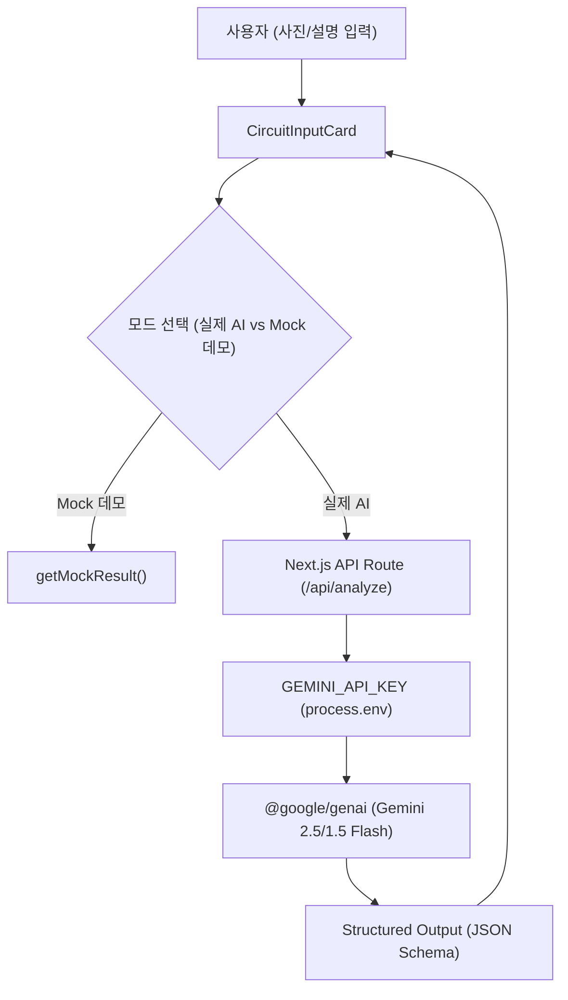

# 회로 분석 AI - Gemini AI 연동 및 고도화 계획서 (AI Integration Plan)

> **문서 정보**
> - **프로젝트명**: 회로 분석 AI (Circuit Analysis AI)
> - **작성일**: 2026-08-27
> - **기반 문서**: [PRD.md](file:///c:/ai/PRD.md), [API_SPEC_MOCK.md](file:///c:/ai/docs/API_SPEC_MOCK.md)
> - **관리 경로**: [`docs/AI_INTEGRATION_PLAN.md`](file:///c:/ai/docs/AI_INTEGRATION_PLAN.md)

---

## 1. 개요 및 비전

본 문서에서는 기존 프론트엔드 MVP (Mock 데모 모드) 기반에서 구글 **Gemini Multimodal Vision AI** 모델을 직접 연동하여, **실제 입력된 회로 사진 및 설명을 실시간 분석**하는 인공지능 기반 서비스 고도화 체계를 정의합니다.

---

## 2. Gemini AI 연동 아키텍처



---

## 3. 세부 개발 개선 단계 (Phases)

### 📌 Phase 1: Gemini SDK 및 API Route 구축 (완료/진행 중)
- **환경 변수**: `.env` 파일의 `GEMINI_API_KEY` 보안 로딩
- **패키지**: `@google/genai` 패키지 설치
- **API Route**: `app/api/analyze/route.ts` 구현
  - Vision 멀티모달 프롬프트 엔지니어링 (회로 부품, 신호 흐름, 전체 동작 원리 추출)
  - `responseSchema`를 통한 `AnalysisResult` 100% 규격화 JSON 반환

### 📌 Phase 2: 클라이언트 실시간 연동 (완료/진행 중)
- **`CircuitAnalyzer` 연동**:
  - `[실제 Gemini AI]` vs `[모의 데모]` 선택 스위처 제공
  - 이미지를 base64 데이터로 변환 후 `/api/analyze`로 전송
  - AI 분석 에러(회로 아님, 분석 실패 등) 핸들링

### 📌 Phase 3: AI 분석 정확도 및 안전장치 고도화 (차기 개선)
- **회로 부품 정밀 추출**: 저항 값(Color Code), 커패시터 정격, IC 핀 번호 서술 정확도 향상
- **불확실성 안내 자동화**: AI의 판단 확신도(Confidence level) 기반으로 `cautions` 경고 목록 생성
- **레이트 리밋 및 캐싱**: 동 시간대 API 과호출 방지 및 동일 이미지 분석 결과 메모이제이션

---

## 4. 프롬프트 구조 가이드라인 (System Prompt)

```text
너는 최고 수준의 전자공학 전문가 겸 친절한 교수님이야.
사용자가 제출한 회로 사진이나 회로 설명을 바탕으로 초보자(대학생/초보 개발자)가 단번에 이해할 수 있도록 분석 결과를 JSON 형태로 정밀하게 출력해줘.

출력 JSON 스키마:
- summary: 전체 회로 요약 (2-3문장)
- summaryHighlight: 가장 중요한 요약 핵심 문장 (1문장)
- parts: 주요 부품 배열 [{ ref, name, tag, generalRole, circuitRole }]
- flow: 신호 흐름 단계 배열 [{ title, detail }]
- principle: 전체 동작 원리 문단 배열 [문단1, 문단2]
- cautions: 확인이 필요한 부분/주의사항 배열 [주의1, 주의2]
- blurry: 이미지 해상도/흐림 여부 (boolean)
```
