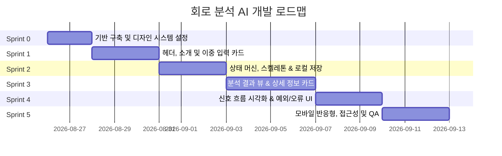

# 회로 분석 AI 프론트엔드 MVP 개발 계획서 (Development Plan)

> **문서 정보**
> - **프로젝트명**: 회로 분석 AI (Circuit Analysis AI) - 프론트엔드 MVP
> - **기반 문서**: [PRD.md](file:///c:/ai/PRD.md)
> - **작성일**: 2026-08-26
> - **관리 경로**: [`docs/DEVELOPMENT_PLAN.md`](file:///c:/ai/docs/DEVELOPMENT_PLAN.md)

---

## 1. 개요 및 개발 목표

본 프로젝트는 전자공학 초보자(대학생 및 초보 개발자)가 회로 사진이나 설명을 입력했을 때, 주요 부품, 부품별 역할, 신호 흐름, 전체 동작 원리를 단일 화면에서 직관적으로 이해할 수 있도록 돕는 **완성도 높은 단일 페이지 프론트엔드 프로토타입** 구축을 목표로 합니다.

### 핵심 준수 원칙 (PRD 제약조건)
- **단일 페이지(SPA) 구조**: 별도의 페이지 이동이나 히스토리/설정 사이드바 없음.
- **순수 프론트엔드 MVP**: 실제 백엔드, DB, 사용자 인증, 결제, 외부 AI API 연결은 배제하고 Mock Data 및 프론트엔드 인터랙션으로 구현.
- **디자인 정체성**: 화이트/밝은 회색 배경 + 블루/인디고 포인트 컬러. Notion, Linear, Vercel 스타일의 깔끔하고 친절한 SaaS UI. (검은 배경/네온/해커 스타일 금지)
- **반응형 보장**: 데스크톱(1000~1200px)부터 모바일(375px)까지 가로 스크롤 없이 자연스러운 1열/2열 재배치 및 터치 영역(44px 이상) 제공.

---

## 2. 스프린트 로드맵 요약



---

## 3. 상세 스프린트 계획

### 🚀 Sprint 0: 기반 구축 및 디자인 시스템 (Project Setup & Design Tokens)
- **목표**: Next.js, Tailwind CSS, shadcn/ui 기반 환경 및 PRD 맞춤 스타일 시스템 정립.
- **세부 태스크**:
  1. `docs/` 폴더 생성 및 문서 관리 체계 수립.
  2. Tailwind CSS 기반 라이트 테마 토큰 설정 (Indigo/Blue Accent, Neutrals, Warning/Error Soft Card).
  3. Typography 계층 정립 (제목, 본문, 보조 텍스트, 코드/라벨).
  4. 공통 UI 컴포넌트(Button, Card, Badge, Alert, Textarea, Skeleton 등) 토큰 검증.
- **완료 조건 (Definition of Done)**:
  - 글로벌 스타일가이드 및 기본 레이아웃 프레임이 구동됨.

---

### 🎨 Sprint 1: 상단 헤더, 소개 영역 & 이중 입력 카드 (Input Domain)
- **목표**: PRD Section 4, 5, 6에 정의된 상단 레이아웃 및 2가지 방식(사진/텍스트) 입력 UX 구현.
- **세부 태스크**:
  1. `AppHeader`: 회로 아이콘 + "회로 분석 AI" 타이틀 (우측 메뉴/프로필 비활성화).
  2. `IntroSection`: 메인 헤드라인("처음 보는 회로도, AI로 빠르게 이해하세요.") 및 보조 설명.
  3. `CircuitInputCard`:
     - **A. 사진 업로드 Dropzone**: Drag & Drop, 클릭 선택, 확장자 안내(JPG, JPEG, PNG), 미리보기 썸네일, 파일명 표시, 삭제(X) 및 이미지 변경 UI.
     - **B. 구분선**: "또는" 텍스트 divider.
     - **C. 텍스트 입력 Area**: Label("회로 설명"), Placeholder 예시 포함 (5~6줄 높이, 패딩 확보).
  4. 입력 유효성 검사 (빈 입력 시 테두리 강조 및 에러 메시지 표시 준비).
- **완료 조건**:
  - 드롭존 파일 선택/미리보기/삭제 및 텍스트 입력을 지원하는 입력 카드가 완성됨.

---

### ⚙️ Sprint 2: 상태 머신, 로딩 스켈레톤 및 저장소 (State & Loader)
- **목표**: PRD Section 7, 8, 9, 11, 12의 상태 변화 인터랙션 및 브라우저 저장 구현.
- **세부 태스크**:
  1. `CircuitAnalyzer` 상태 머신 정립:
     - 상태: `IDLE` (초기) | `VALIDATING_ERROR` | `LOADING` (분석 중) | `SUCCESS` (분석 완료) | `ERROR_*` (예외 처리).
  2. `AnalysisCTAButton`:
     - 기본 상태("회로 분석하기" + Sparkles 아이콘).
     - 로딩 상태(Spinner + "분석 중...", 비활성화 처리).
     - 데스크톱 적정 폭 / 모바일 100% 폭 대응.
  3. `AnalysisEmpty`: 초기 안내 뷰 ("분석 결과가 여기에 표시됩니다.").
  4. `AnalysisSkeleton`: 결과 UI와 동일한 구조의 스켈레톤 로딩 뷰 ("회로를 분석하고 있습니다.").
  5. `useLocalStorage` 훅: "이 브라우저에 마지막 분석 결과가 저장됩니다." 안내 문구 및 브라우저 세션 보존.
- **완료 조건**:
  - 버튼 클릭 시 스켈레톤 로딩 ➔ Mock 결과 전환 및 재분석 흐름이 매끄럽게 동작함.

---

### 📊 Sprint 3: 분석 결과 뷰 & 상세 정보 카드 (Result View Part 1)
- **목표**: PRD Section 10-1, 10-2, 10-4, 10-5에 따른 정보 계층별 결과 카드 컴포넌트화.
- **세부 태스크**:
  1. `AnalysisResultView`: 상단 헤드라인 ("분석 완료" + 성공 아이콘) 및 보조 텍스트.
  2. `CircuitSummaryCard` (10-1): 핵심 요약 설명 및 중요 문장 하이라이트.
  3. `ComponentListCard` (10-2):
     - R1(저항), D1(LED), C1(커패시터), U1(IC) 4개 부품 카드.
     - "일반적인 역할" vs "이 회로에서의 역할" 명확 구분 배지/텍스트 구조.
     - 데스크톱 2열 Grid / 모바일 1열 Stack 반응형 layout.
  4. `OperationPrincipleCard` (10-4): 행간/문단 간격이 확보된 구체적 동작 원리 서술 카드.
  5. `UncertaintyNoticeCard` (10-5): 연한 노란색 주의 배경 + Warning 아이콘 + 확인 필요 사항 안내.
- **완료 조건**:
  - 요약, 부품 목록, 동작 원리, 주의사항 섹션이 완벽한 Typography 계층으로 표현됨.

---

### 🔄 Sprint 4: 신호 흐름 시각화 & 예외/오류 UX (Result View Part 2 & Edge Cases)
- **목표**: PRD Section 10-3, 13, 14에 따른 직관적 신호 흐름 및 5가지 예외/오류 UI 처리.
- **세부 태스크**:
  1. `SignalFlowView` (10-3):
     - Step Flow UI ([5V 입력] ➔ [저항 전류 제한] ➔ [LED 전류 전달] ➔ [LED 점등]).
     - 데스크톱: 가로/세로 흐름 대응 | 모바일: 세로 Step Flow.
     - 각 단계별 번호/아이콘 부착.
  2. **오류/경고 UI 컴포넌트 구현 (PRD 13)**:
     - **A. 빈 입력**: 테두리 붉은색 강조 + 경고 문구.
     - **B. 회로가 아닌 이미지**: Inline Error Card + "다른 이미지 선택" 버튼.
     - **C. 이미지가 흐린 경우**: Warning Card + 선명한 사진 재요청.
     - **D. 분석 실패**: Error Card + "다시 분석하기" 버튼.
     - **E. 일부 정보 불확실**: 해당 섹션 Empty/Warning 상태 가이드.
  3. **Demo Scenario Controller**:
     - 다양한 Mock 시나리오(정상 결과, 오류 이미지, 흐린 이미지, 분석 실패 등)를 테스트할 수 있는 프론트엔드 데모 스위처 제공.
- **완료 조건**:
  - 신호 흐름 Step UI와 PRD 13의 5가지 오류/경고 케이스가 모두 전환 가능하게 구현됨.

---

### 📱 Sprint 5: 모바일 반응형 최적화, 접근성 및 최종 검증 (Polish & Quality Assurance)
- **목표**: PRD Section 15, 16, 17, 18 기준 충족 검증 및 최종 QA.
- **세부 태스크**:
  1. **반응형 검증 (375px 모바일)**:
     - 모바일 가로 스크롤 발생 유무 점검.
     - 1열 전환, width 100% 터치 영역 (44px 이상) 확보.
  2. **접근성 및 UI 디테일**:
     - Hover / Active / Disabled / Focus-visible 상태 스타일 정밀 점검.
     - ARIA label (아이콘 전용 버튼, 이미지 미리보기 제거 버튼 등).
     - Text 대비 비율(Color contrast) 확보.
  3. **제외 대상 기능 재확인**:
     - Auth/DB/결제/히스토리/편집기/계산기 등 PRD 17항 금지 요소가 완전히 배제되었는지 점검.
  4. **문서 최종화**:
     - `docs/` 폴더 내 추후 백엔드 연동 및 확장 계획 문서(선택사항) 정립.
- **완료 조건**:
  - 375px 모바일 디바이스 테스트 통과 및 PRD 요구사항 100% 충족.

---

## 4. docs 폴더 관리 지침

향후 개발 진행 과정에서 발생되는 변경사항 및 문서는 아래 구조로 `docs/` 내에서 관리합니다.

```
c:\ai\docs\
├── DEVELOPMENT_PLAN.md    # 전체 개발 계획서 (본 문서)
├── SPRINT_LOG.md          # 스프린트 진행 현황 및 데모 테스트 기록 (작성 예정)
└── API_SPEC_MOCK.md       # 향후 백엔드/AI API 연동을 위한 Mock Data 스키마 정의서 (작성 예정)
```

---

## 5. 결론 및 다음 단계

본 개발 계획서는 PRD.md의 단일 화면 프론트엔드 MVP 요구사항을 충실히 구현하기 위한 6개의 스프린트(Sprint 0 ~ 5)로 구성되었습니다. 각 스프린트는 독립적으로 검증 가능하며, 사용자가 실제 AI 서비스를 사용하는 듯한 직관적이고 완성도 높은 경험을 제공합니다.
